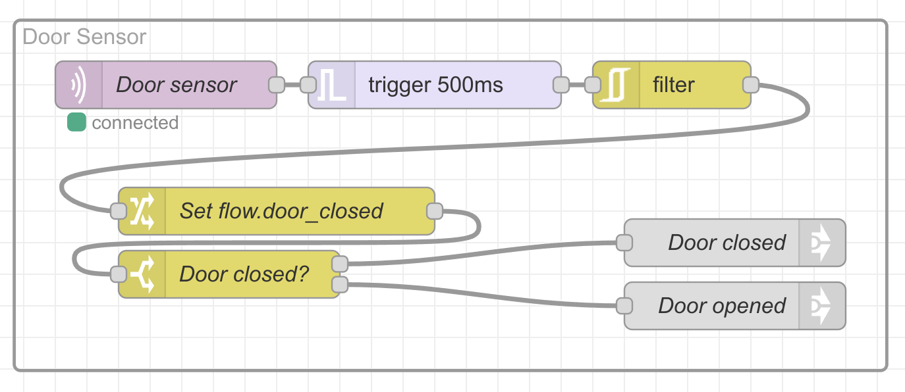
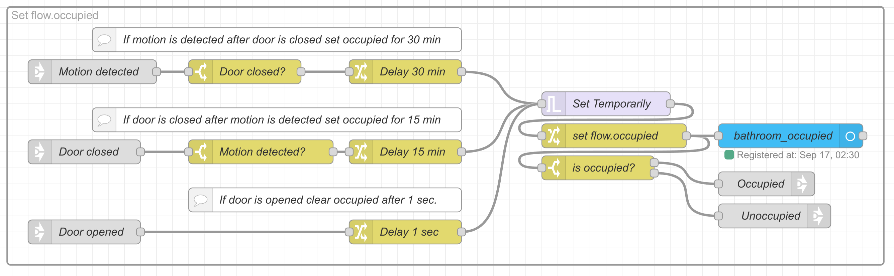
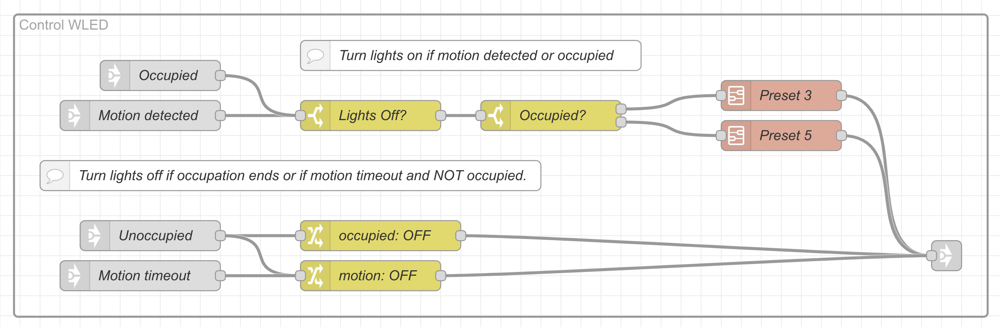
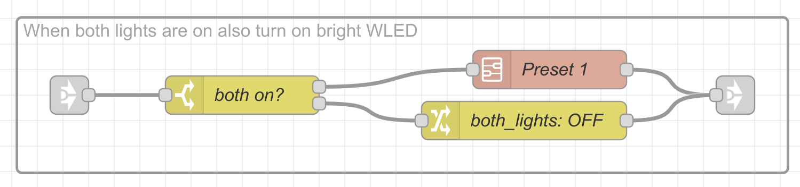

# Priority Stack Subflow


Für die meisten Ereignisse kümmert sich der JavaScript-Code im Function-Node oben links darum, dass nur ausreichend wichtige Steuerbefehle weitergegeben werden. Die Knoten in den beiden Gruppen behandeln den Spezialfall, dass ein Mensch mit der WLED-App den LED-Streifen eingeschaltet hat. Dann nämlich soll kein Ereignis, egal mit welcher Priorität, die Einstellung des Nutzers überschreiben.

Die wichtigste Idee im gesamten Node-Graphen ist der „Priority Stack“: Der JavaScript-Node speichert Ereignisse, die nicht „ausgeschaltet“ wurden, zusammen mit einer Priorität in einer Flow-Variablen. Die Rückgabe ist immer das Ereignis mit der höchsten Priorität und nicht das, welches zuletzt reinkam:

```javascript
var active = flow.get("active");
var priority = parseInt(msg.priority || "0");

if (msg.payload === "reset") { 
  // Den aktuellen Stack ganz löschen
  flow.set("active", {});
  msg.priority = 999;
  msg.payload = {"power":0};
  msg.topic = "reset";
  return msg;
} else if (msg.payload === "off") {
  if (typeof(msg.topic) != "string") {
    return null;
  }
  // Ist Topic nicht im Stack: ignorieren!
  if (!(active[msg.topic] instanceof Array)) {
    return null;
  }  // Topic aus dem Stack entfernen
  delete active[msg.topic];
} else {
  // Kein Ausschalten: Topic dem Stack hinzufügen
  active[msg.topic] = [priority, Date.now(), msg.payload];
}

// Alle Topics löschen, die älter als 2 Stunden sind.
var too_long_ago = new Date();
too_long_ago.setHours(too_long_ago.getHours() - 2);
for (const topic in active) {
  if (active[topic][1] < too_long_ago) {
    delete active[topic];
  }
}

// Änderungen am Stack in flow.active speichern. 
flow.set("active", active);

// Das Topic mit der höchseten Priorität heraussuchen...
msg.priority = -1;
msg.payload = {"power":0};
msg.topic = "empty";

for (const topic in active) {
  if (active[topic][0] > msg.priority ) {
    msg.topic = topic; 
    msg.priority = active[topic][0];
    msg.payload = active[topic][2];
  }
}
// ... und zurück geben.
return msg;
```

Der Priority Stack hat zusätzlich folgenden Code "On Start":

```javascript
// Code added here will be run once
// whenever the node is started.
flow.set("active", {});
flow.set("origin", "external");
```

Der JavaScript-Node in der Mitte war etwas besser darin mit Variablen umzugehen, die `undefined` sind als ein Template-Node. Er macht aber nicht mehr, als den String für das HTTP-API von WLED zusammenzubauen:

```javascript
var api_string = "win";

if ("transition" in msg) {
  api_string += "&TT=" + msg.transition;
}

const command_map = new Map();
command_map.set('power', 'T');
command_map.set('preset', 'PL');
command_map.set('brightness', 'A');
command_map.set('effect_index', 'FX');
command_map.set('effect_speed', 'SX');
command_map.set('effect_intensity', 'SI');
command_map.set('color1', 'CL');
command_map.set('color2', 'C2');
command_map.set('color3', 'C3');

for (const [key, cmd] of command_map) {
  if (key in msg.payload) {
    api_string += "&" + cmd + "=" + msg.payload[key];
  }
}

msg.payload = api_string;

return msg;
```

# Node-Gruppen


Durch den Trigger-Node stellt sich Node-Red einen Wecker, um nach drei Minuten abzuspeichern, dass nun eine Weile keine Bewegung mehr erkannt wurde. Die grauen Link-Out-Nodes sind unsichtbar mit gleichnamigen Link-In-Nodes an anderen Stellen verbunden. Sie helfen, große Graphen übersichtlich zu halten.



Der Türsensor kann prellen, also mehrfach in kurzer Folge Auf- und Zu-Ereignisse verschicken. Die Kombination aus einem Trigger-Node mit einer halben Sekunde Verzögerung und einem Filter-Node lässt davon maximal das erste und das letzte Ereignis passieren.



Je nach Reihenfolge der Ereignisse setzt ein Trigger-Node unterschiedlich lange Time-outs für die Anwesenheitserkennung.



Der WLED-Streifen geht an, wenn der Bewegungsmelder auslöst und aus, sobald das Bad nicht mehr belegt ist. Wenn er leuchtet, nutzt er Preset drei oder fünf je nach Belegungsstatus. Preset drei ist ein wenig heller.


Der „Bathroom Light“-Node steuert Tasmota an, das die Decken- und Spiegelleuchte an- oder ausschaltet. Wird der Lichtschalter gedrückt, erzeugt er ein Ereignis. Die rechte Hälfte speichert die Stellung der Lichtschalter in Flow-Variablen und schickt die Ereignisse weiter.



Leuchten die Spiegel- und die Deckenlampe soll auch der LED-Streifen in der Schattenfuge hell und weiß strahlen.